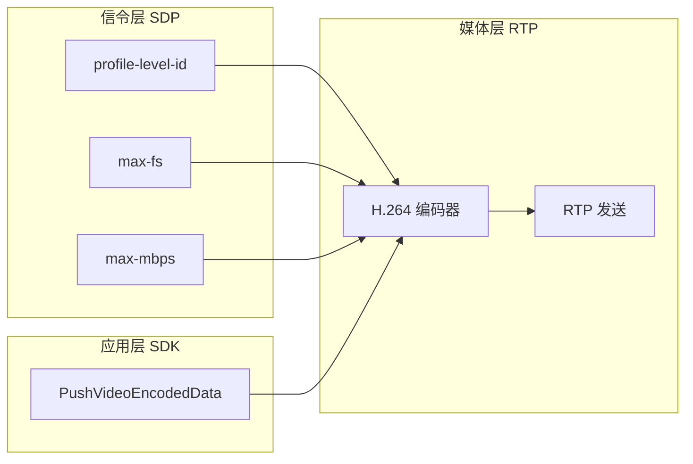
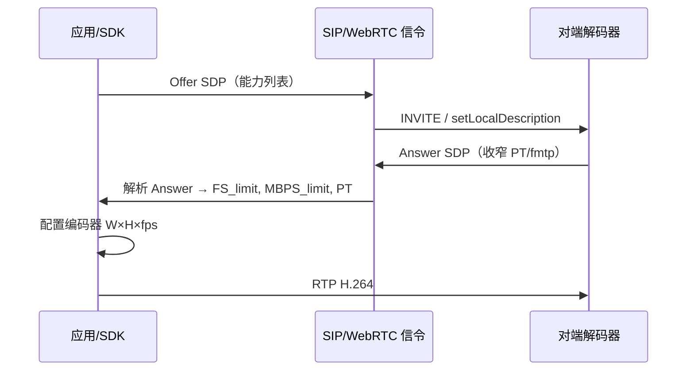

<!--
author: Yan Zhennan
date: 2026-05-22
-->

# RTC 视角：支持分辨率与 profile-level-id / max-fs / max-mbps 的关系

本文从**实时通信（RTC）**工程视角说明：在 SIP/WebRTC 等媒体协商中，**SDP 声明的 H.264 能力**如何约束**可发送/可解码的分辨率与帧率**，以及与本仓库 **Agora Golang Server SDK** 的对接关系。

规范依据与 [sip-solution.md](./sip-solution.md) 一致：**RFC 3264**（Offer/Answer）、**RFC 6184**（H.264 RTP fmtp）、**RFC 7798**（H.265 RTP fmtp）、**ITU-T H.264 Table A-1**；WebRTC 栈同样采用上述 fmtp，无独立的「216000 = 4K」规则。

文档含 **两套 RTC 示例 SDP**：§5 为 Level 3.1（不支持 1080p）；§6 为 Level 4.1（支持 1080p@≤30fps）。

---

## 1. RTC 里「支持的分辨率」指什么

在 RTC 中，**分辨率不是 SIP/SDP 里的一条独立字段**，而是端到端协商结果：

| 层次 | RTC 中的含义 |
|------|----------------|
| **信令（SIP INVITE/200、或 WebRTC SDP）** | 声明**解码端能力上限**（Profile/Level、max-fs、max-mbps、PT、packetization-mode 等） |
| **媒体（RTP H.264）** | 发送端按协商结果编码 **(width, height, fps)**，RTP 打包上报 |
| **SDK（如 Agora）** | `PushVideoEncodedData` 等 API 的宽高、fps、codec 须落在协商能力内，否则对端可能拒收或解码异常 |

因此：

> **「支持的分辨率」= 在 SDP 能力约束下，编码器允许输出的 (W, H, f) 集合 ∩ Offer/Answer 交集 ∩ 实际 Profile 语法。**

与点播/文件不同，RTC 还受**帧率、抖动缓冲、带宽（b=AS/TIAS）**影响；几何上限仍由 **max-fs / max-mbps / profile-level-id** 决定。

---

## 2. 三参数在 RTC 协商中的分工



### 2.1 profile-level-id（Profile + Level 基线）

- **来源**：SDP `a=fmtp`（RFC 6184），WebRTC `setRemoteDescription` 后同样解析。
- **作用**：
  - 限定 **H.264 Profile**（Baseline / High 等）与 **Level**（如 `1f` → Level 3.1）；
  - 带出 Table A-1 默认 **MaxFS₀、MaxMBPS₀** 及编码工具集（B 帧、8×8 等）。
- **RTC 要点**：Answer 后发送的 SPS 须与协商的 profile-level-id 一致；Agora 推流前确认编码器 Profile/Level 与对端 PT（109/110/111）匹配。

### 2.2 max-fs（单帧「画面大小」上限）

- **单位**：macroblocks / frame（16×16 像素一块）。
- **RTC 作用**：限制**单帧最大解码画面**，与帧率无关；是 RTC 侧「能不能解这一帧」的硬上限。
- **覆盖规则**：若 fmtp 带 `max-fs`，替换 Level 默认 MaxFS（须 ≥ Level 表值，RFC 6184）。

### 2.3 max-mbps（「尺寸 × 帧率」联合上限）

- **单位**：macroblocks / second。
- **RTC 作用**：限制**每秒处理的宏观块总量**，体现「大画面 ↔ 低帧率」权衡；高 fps 会压低允许的最大 FS。
- **覆盖规则**：若 fmtp 带 `max-mbps`，替换 Level 默认 MaxMBPS。

### 2.4 三者关系（一句话）

```
profile-level-id  →  Level/Profile 基线（MaxFS₀, MaxMBPS₀）
max-fs            →  FS_limit（单帧上限）
max-mbps          →  MBPS_limit（每秒处理上限）
(W, H, fps)       →  FS、MBPS 必须同时 ≤ 上述 limit
```

**SDP 不写像素宽高**；RTC 发送前必须用公式把目标分辨率换算成 FS/MBPS 再比对。

---

## 3. RTC 统一计算公式

### 3.1 像素 → 宏观块

```
W_mbs = ceil(W / 16)
H_mbs = ceil(H / 16)
FS    = W_mbs * H_mbs
MBPS  = FS * fps
```

### 3.2 从 profile-level-id + fmtp 得到能力上限

设 Level 表值为 MaxFS₀、MaxMBPS₀（由 profile-level-id 的 level_idc 查 Table A-1）：

```
FS_limit   = max-fs     若 SDP 存在，否则 MaxFS₀
MBPS_limit = max-mbps   若 SDP 存在，否则 MaxMBPS₀
```

给定帧率 `fps`：

```
FS_max(fps) = min( FS_limit, floor(MBPS_limit / fps) )
```

### 3.3 分辨率是否被 RTC 对端「支持」

```
ceil(W/16) * ceil(H/16) <= FS_max(fps)
MBPS = FS * fps <= MBPS_limit
```

且码流符合协商的 **profile-level-id**（及 packetization-mode 等 fmtp）。

---

## 4. RTC 协商流程中的落点（SIP / WebRTC 通用）



| 阶段 | RTC 工程师应做 |
|------|----------------|
| Offer 解析 | 读出 H.264 PT 与 fmtp：profile-level-id、max-fs、max-mbps |
| Answer | 以 **Answer 中保留的 fmtp** 为准（RFC 3264，能力只能收紧） |
| 编码配置 | 用 §3 公式验算 W×H×fps |
| Agora 推流 | `PushVideoEncodedData` 宽高/fps 不超过 FS_max；codec 与 PT 一致 |

**注意**：`b=TIAS` / `b=AS` 是带宽**提示**，不替代 max-fs/max-mbps；但 RTC 实践中码率过高会导致丢包卡顿，需与 TIAS 一并评估。

---

## 5. 示例 A：Level 3.1 SDP（兆维 / Polycom 类）

（与 [sip-solution.md](./sip-solution.md) 同一 SDP。）

| 参数 | 值 |
|------|-----|
| profile-level-id | `42801f`（PT 109/110 Baseline L3.1）、`64001f`（PT 111 High L3.1） |
| max-fs | 3840 |
| max-mbps | 216000 |
| Level 3.1 默认 | MaxFS₀=3600，MaxMBPS₀=108000（已被 fmtp 抬高） |

**RTC 能力上限：**

```
FS_limit   = 3840
MBPS_limit = 216000
```

| fps | FS_max(fps) | RTC 侧推荐最大标准分辨率 |
|-----|-------------|---------------------------|
| ≤30 | 3840 | **1280×768**（FS=3840 触顶） |
| 60 | 3600 | **1280×720**（受 max-mbps 限制） |

| 目标分辨率 | FS | @30fps | RTC 是否可发 |
|------------|-----|--------|--------------|
| 1920×1080 | 8160 | MBPS=244800 | **否** |
| 3840×2160 | 32400 | MBPS=972000 | **否** |
| 1280×720 | 3600 | MBPS=108000 | **是** |
| 1280×768 | 3840 | MBPS=115200 | **是**（≤30fps） |

**示例 A 结论（RTC）：** 约 **1280×768 @ ≤30fps** 或 **1280×720 @ 60fps**；**不支持 1080p / 4K**。

---

## 6. 示例 B：Level 4.1 SDP（支持 1080p）

以下为另一终端视频能力片段（原文有换行/空格笔误，此处为纠正后的有效 SDP）。

**原始片段（保留笔误供对照）：**

```text
a=rtpmap: 101 telephone-event/8000
a=fmtp: 101 0-15
m=video 50008 RTP/AVP 97 98 99 108 34 104 100 117
b=TIAS: 4096000
a=fmtp:97 profile- level -id=640029; max-mbps=245760; max-fs=8192; packet ization-a=rtpmap: 98 H264/90000
...
```

**纠正后的视频部分：**

```text
m=video 50008 RTP/AVP 97 98 99 108 34 104 100 117
b=TIAS:4096000
a=rtpmap:97 H264/90000
a=fmtp:97 profile-level-id=640029;max-mbps=245760;max-fs=8192;packetization-mode=1
a=rtpmap:98 H264/90000
a=fmtp:98 profile-level-id=428029;max-mbps=245760;max-fs=8192;packetization-mode=1
a=rtpmap:99 H264/90000
a=fmtp:99 profile-level-id=428029;max-mbps=245760;max-fs=8192;packetization-mode=1
a=rtpmap:108 H265/90000
a=fmtp:108 profile-space=0;profile-id=1;level-id=120;max-fps=3000
a=rtpmap:34 H263/90000
a=fmtp:34 CIF4=1;CIF=1;QCIF=1
```

### 6.1 H.264（PT 97 / 98 / 99）

| PT | profile-level-id | 解读 |
|----|------------------|------|
| **97** | `640029` | High Profile，`level_idc=0x29` → **Level 4.1** |
| **98 / 99** | `428029` | Baseline，`level_idc=0x29` → **Level 4.1** |

**Level 4.1（Table A-1）与 fmtp：**

| 符号 | Level 4.1 默认 | 本 SDP fmtp |
|------|----------------|-------------|
| MaxFS | 8192 | **8192**（与表一致） |
| MaxMBPS | 245760 | **245760**（与表一致） |

**RTC 能力上限（H.264）：**

```
FS_limit   = 8192
MBPS_limit = 245760
```

### 6.2 H.264 分辨率验算（示例 B）

**1080p（1920×1080）：**

```
W_mbs=120, H_mbs=68, FS=8160
8160 <= 8192  → 满足 max-fs
```

| fps | MBPS | ≤245760 |
|-----|------|---------|
| **30** | 244800 | **是**（余量 960） |
| **31** | 252960 | **否** |
| **60** | 489600 | **否** |

**RTC 结论：支持 1080p，H.264 帧率上限约 30 fps**（`floor(245760/8160)=30`）。

**4K（3840×2160）：** FS=32400 >> 8192 → **不支持**。

**60 fps 时：**

```
FS_max(60) = min(8192, floor(245760/60)) = 4096
```

1080p（FS=8160）**不可用**；宜 **1280×720**（FS=3600）等 FS≤4096 的制式。

| fps | FS_max | RTC 推荐最大标准分辨率 |
|-----|--------|------------------------|
| **≤30** | 8192 | **1920×1080（1080p）** |
| **60** | 4096 | **约 1280×720** |

边界（仍 ≤8192）：**1920×1088**（FS=8160）、**2048×1024**（FS=8192 触顶），需编码器与对端支持非标准宽高。

### 6.3 H.265（PT 108，RFC 7798）

```text
a=fmtp:108 profile-space=0;profile-id=1;level-id=120;max-fps=3000
```

| 参数 | RTC 典型含义 |
|------|----------------|
| `level-id=120` | 常表示 **Level 4.0**（level×30 编码，4.0→120） |
| `max-fps=3000` | 常表示 **30.00 fps**（1/100 fps 为单位） |
| `profile-id=1` | Main Profile 等，须与码流一致 |

HEVC Level 4.0 下单帧亮度像素约 **≤2228224**（约 1080p 量级），**不支持 4K**。

**RTC 结论（H.265）：** 若 Answer 选 **PT 108**，能力约 **1080p @ ≤30fps**；**不能**用 H.264 的 FS/MBPS 公式套算，须按 RFC 7798 与 HEVC Table A.1。

### 6.4 其他与带宽

| 项 | 说明 |
|----|------|
| `b=TIAS:4096000` | 约 **4 Mbps** 带宽提示；不替代 max-fs/max-mbps，但 RTC 下 1080p@30 更易满足链路预期 |
| `telephone-event/101` | DTMF（RFC 4733），与视频分辨率无关 |
| PT 34 H263 | CIF/QCIF 等，独立于 H.264 1080p 能力 |

**示例 B 结论（RTC）：**

| 编码 | 能力摘要 |
|------|----------|
| **H.264（97/98/99）** | **1080p @ ≤30fps**；60fps 约 **720p**；**不支持 4K** |
| **H.265（108）** | 约 **1080p @ ≤30fps**；**不支持 4K** |

---

## 7. 示例 A / B 对比（RTC）

| 项目 | 示例 A（§5） | 示例 B（§6） |
|------|--------------|--------------|
| Level | 3.1 | **4.1** |
| max-fs | 3840 | **8192** |
| max-mbps | 216000 | **245760** |
| 1080p @ 30fps | **否** | **是** |
| 4K | 否 | 否 |
| ≤30fps 最大（H.264） | ~1280×768 | **1920×1080** |
| 60fps 最大（H.264） | ~1280×720 | ~1280×720 |
| TIAS | ~1 Mbps | **~4 Mbps** |
| H.265 | 无 | PT 108（Level 4.0） |

---

## 8. RTC 与纯 RFC 表述的差异（易混点）

| 话题 | RTC 工程理解 | 常见误区 |
|------|--------------|----------|
| max-mbps=216000 | H.264 L3.2 量级 **MBPS** 能力扩展 | 等于 2160p / 4K |
| 支持 4K / 1080p | 必须用 FS、MBPS 公式验算 | 只看 Level 或只看一个 fmtp |
| WebRTC vs SIP | 均用 RFC 6184 fmtp + SDP O/A | WebRTC 有另一套「分辨率字段」 |
| Agora SDK | 在协商能力内推 Encoded Video | SDK 能发 1080p ≠ 对端 SDP 允许 1080p |
| 帧率变化 | fps 升高 → FS_max 下降 | 认为 max-fs 单独决定一切 |

---

## 9. Agora Golang Server SDK 集成检查清单

对接 SIP 终端时，在调用 `PushVideoEncodedData`（或转码推流）前：

- [ ] 从 **200 OK Answer** 确认最终视频 **PT**（H.264 或 H.265）
- [ ] 记录 Answer 中 **profile-level-id、max-fs、max-mbps、packetization-mode**（H.265 另记 level-id、max-fps 等）
- [ ] 用 §3 公式（H.264）计算计划 **W×H×fps** 的 FS、MBPS
- [ ] 确认 `FS <= FS_max(fps)` 且 `MBPS <= MBPS_limit`
- [ ] 编码器 Profile/Level 与协商 fmtp 一致
- [ ] **示例 A（§5）**：勿发 1080p/4K；建议 **1280×720 或 1280×768**
- [ ] **示例 B（§6）**：可发 **1080p @ ≤30fps**；60fps 勿发 1080p；仍**勿发 4K**
- [ ] 若业务需要 1080p 但对端仅为示例 A：推动 **re-INVITE / 重协商** 至示例 B 量级（max-fs>8160 等）

---

## 10. 速查：三参数 → 分辨率（RTC）

```
1. profile-level-id → Level → MaxFS₀, MaxMBPS₀（基线）
2. max-fs, max-mbps → FS_limit, MBPS_limit（fmtp 覆盖）
3. FS_max(f) = min(FS_limit, floor(MBPS_limit / f))
4. ceil(W/16)*ceil(H/16) <= FS_max(f)  →  RTC 可发送该分辨率@f
```

**示例 A（§5）：** 约 **1280×768 @ ≤30fps** 或 **1280×720 @ 60fps**；**不支持 1080p / 4K**。

**示例 B（§6）：** **1080p @ ≤30fps**（H.264/H.265）；**60fps 约 720p**；**不支持 4K**。

profile-level-id 决定 **语法/Profile**；max-fs / max-mbps 决定 **像素与帧率几何上限**（H.265 用 RFC 7798 参数体系）。

---

## 11. 相关文档

| 文档 | 内容 |
|------|------|
| [sip-solution.md](./sip-solution.md) | 完整 SIP/SDP 解析、RFC 验算、附录问答 |
| [example_h264_decode/兆维集成方案.md](./example_h264_decode/兆维集成方案.md) | 兆维频道类型、推流最佳实践 |

---

## 12. 修订记录

| 日期 | 说明 |
|------|------|
| 2026-05-22 | 初版：RTC 视角下分辨率与 profile-level-id / max-fs / max-mbps 关系及 Agora 集成清单 |
| 2026-05-22 | §6 示例 B：Level 4.1 SDP（1080p@30fps、H.265 PT 108）、§7 对比表 |
