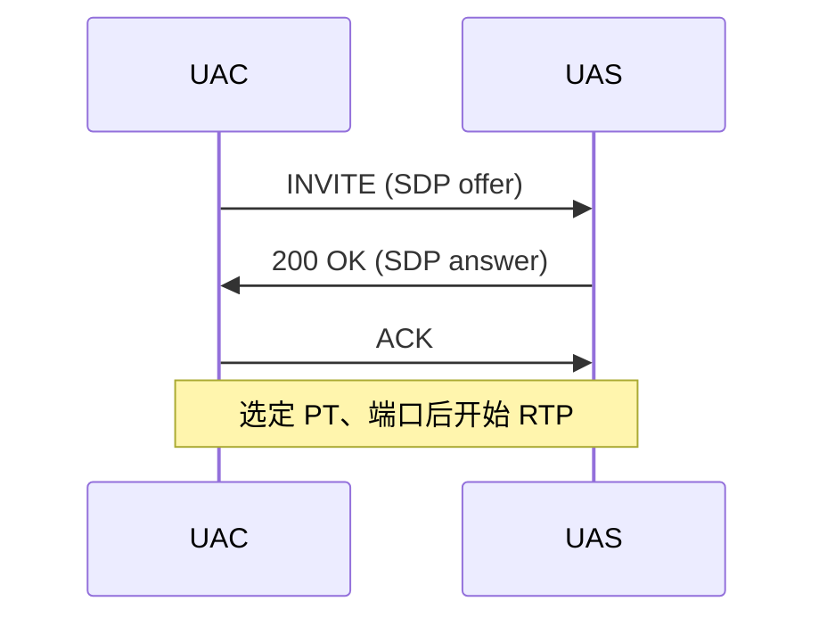

<!--
author: Yan Zhennan
date: 2026-05-22
-->

# SIP / SDP H.264 能力解析与集成说明

本文档基于 **RFC 3261**（SIP）、**RFC 4566**（SDP）、**RFC 3264**（Offer/Answer）、**RFC 6184**（H.264 RTP/SDP fmtp）及 **ITU-T H.264 Annex A Table A-1**，说明兆维 / Polycom 类终端 SDP 中的媒体能力，以及与 Agora Server SDK 对接时的分辨率、Profile 约束。

---

## 1. 文档范围

| 包含 | 不包含 |
|------|--------|
| SIP 消息体中 `application/sdp` 的解析 | 完整 SIP 事务（无 INVITE 起始行时无法分析 Dialog） |
| H.264 `profile-level-id`、`max-fs`、`max-mbps` 与分辨率关系 | 音频编解码细节（G.722.1 等）的完整列表 |
| 与 RTC / WebRTC 一致的 fmtp 能力模型 | 将 `216000` 误解为 4K/2160p 的错误推导 |

---

## 2. 示例 SDP 来源说明

以下为设备侧 **SDP offer 能力片段**（SIP 仅体现 `Content-Type: application/sdp` 与 `Content-Length`；完整 SIP 头域需抓包补充）。

**会话级：**

```text
v=0
o=GroupSeries 793118355 0 IN IP4 10.90.0.27
s=-
c=IN IP4 10.90.0.27
b=AS:1024
t=0 0
```

**视频（纠正笔误后的有效行）：**

```text
m=video 16760 RTP/AVP 116 109 110 111 96 34 31
b=TIAS:1024000
a=rtpmap:109 H264/90000
a=fmtp:109 profile-level-id=42801f;max-mbps=216000;max-fs=3840;sar-supported=13;sar=13
a=rtpmap:110 H264/90000
a=fmtp:110 profile-level-id=42801f;packetization-mode=1;max-mbps=216000;max-fs=3840;sar-supported=13;sar=13
a=rtpmap:111 H264/90000
a=fmtp:111 profile-level-id=64001f;packetization-mode=1;max-mbps=216000;max-fs=3840;sar-supported=13;sar=13
```

| 项目 | 值 |
|------|-----|
| 媒体地址 | `10.90.0.27` |
| 视频 RTP 端口 | `16760` |
| 传输 | `RTP/AVP`（UDP RTP） |
| H.264 PT | 109 / 110 / 111 |
| 带宽提示 | `TIAS:1024000`（约 1 Mbps，RFC 3890，不参与 FS/MBPS 几何计算） |

---

## 3. RFC 参考

| 主题 | RFC / 规范 |
|------|------------|
| SIP 消息格式 | RFC 3261 |
| SDP 语法 | RFC 4566 |
| Offer/Answer | RFC 3264 |
| H.264 RTP / fmtp | RFC 6184 |
| H.264 Level 表 | ITU-T H.264 Annex A Table A-1（RFC 6184 引用为 [1]） |
| 带宽 `TIAS` | RFC 3890 |
| WebRTC | 同样使用 RFC 6184 fmtp（经 RFC 8829 等做协商） |

---

## 4. `profile-level-id`、`max-fs`、`max-mbps` 的角色

### 4.1 各参数含义（RFC 6184 §8.2.2）

| 参数 | 含义 |
|------|------|
| **profile-level-id** | 6 位十六进制：`profile_idc` + `profile-iop` + `level_idc`；表示默认 **Profile/子集** 与 **Level**；Level 对应 Table A-1 的 **MaxFS**、**MaxMBPS** 等 |
| **max-fs** | 可选；单帧最大宏观块数（macroblocks/frame）；若存在，**替换**该 Level 在 Table A-1 中的 MaxFS（须 ≥ Level 默认值） |
| **max-mbps** | 可选；最大宏观块处理速率（macroblocks/s）；若存在，**替换** Table A-1 的 MaxMBPS（须 ≥ Level 默认值） |

**SDP 不直接写“分辨率”**，只声明解码能力；像素分辨率由 **(W, H, fps)** 换算为 FS、MBPS 后与之比较。

### 4.2 解析本示例中的 `profile-level-id`

| PT | profile-level-id | 解读 |
|----|------------------|------|
| 109 / 110 | `42801f` | `42` → Baseline；`1f` → level_idc=31 → **Level 3.1** |
| 111 | `64001f` | `64` → High Profile；**Level 3.1** |

**Level 3.1（Table A-1）默认值：**

| 符号 | Level 3.1 |
|------|-----------|
| MaxFS | 3600 |
| MaxMBPS | 108000 |

**本 SDP fmtp 覆盖后：**

| 符号 | 实际采用 |
|------|----------|
| FS_limit | **3840**（max-fs） |
| MBPS_limit | **216000**（max-mbps） |

说明：`216000` 在数值上等于 **Level 3.2** 的 Table A-1 MaxMBPS，**不是** 4K（3840×2160）或 2160 行的标记。

### 4.3 合并规则（能力上限）

记 Level 表值为 MaxFS₀、MaxMBPS₀：

```
FS_limit     = max-fs     若存在，否则 MaxFS₀
MBPS_limit   = max-mbps   若存在，否则 MaxMBPS₀
```

对帧率 `f`（fps），**有效单帧宏观块上限**：

```
FS_max(f) = min( FS_limit, floor(MBPS_limit / f) )
```

分辨率 (W, H) 在能力内，当且仅当：

```
ceil(W/16) * ceil(H/16) <= FS_max(f)
```

且码流 Profile/语法与协商的 **profile-level-id** 一致（RFC 3264 answer 取交集）。

### 4.4 关系示意

```
profile-level-id → Level → Table A-1 (MaxFS₀, MaxMBPS₀)
        ↓
max-fs  → FS_limit（单帧能解多大）
max-mbps → MBPS_limit（每秒宏观块 = 尺寸 × 帧率）
        ↓
(W, H, f) → FS, MBPS = FS × f
        ↓
FS ≤ FS_limit 且 MBPS ≤ MBPS_limit  →  分辨率合法
```

帧率越高，`floor(MBPS_limit/f)` 越小，允许的最大 FS（从而分辨率）越低。

---

## 5. 计算公式（RFC 6184 + H.264）

宏观块为 **16×16** 像素：

```
W_mbs = ceil(W_pix / 16)
H_mbs = ceil(H_pix / 16)
FS    = W_mbs * H_mbs          # macroblocks per frame
MBPS  = FS * fps               # macroblocks per second
```

约束：

```
FS   <= FS_limit
MBPS <= MBPS_limit
```

联立（给定 fps）：

```
FS_max(fps) = min( FS_limit, floor(MBPS_limit / fps) )
ceil(W/16) * ceil(H/16) <= FS_max(fps)
```

---

## 6. 常见分辨率验算（本 SDP）

**已知：** FS_limit = 3840，MBPS_limit = 216000。

| 分辨率 | FS | @30fps MBPS | FS ≤3840 | MBPS ≤216000 |
|--------|-----|-------------|----------|--------------|
| 3840×2160 (4K) | 32400 | 972000 | 否 | 否 |
| 1920×1080 | 8160 | 244800 | 否 | 否 |
| 1280×768 | 3840 | 115200 | 是（触顶） | 是 |
| 1280×720 | 3600 | 108000 | 是 | 是 |

### 6.1 1080p

```
W_mbs = ceil(1920/16) = 120
H_mbs = ceil(1080/16) = 68
FS = 120 * 68 = 8160 > 3840  → 不支持
```

@30fps：MBPS = 244800 > 216000，仍不支持。仅放宽 max-mbps 时理论最高约 26fps，但 **max-fs 仍禁止 FS=8160**。

### 6.2 4K

```
FS_4K = 240 * 135 = 32400 >> 3840
@30fps MBPS = 972000 >> 216000
```

**不支持 4K。**

### 6.3 本 SDP 推荐上限

| 帧率 | FS_max(f) | 推荐最大标准分辨率 |
|------|-----------|-------------------|
| ≤30 fps | 3840 | **1280×768**（FS=3840 触顶） |
| 60 fps | min(3840, 3600)=3600 | **1280×720**（FS=3600） |

---

## 7. 错误推导说明（评审用）

以下结论 **不符合** RFC 6184 / H.264 / RTC SDP 惯例：

| 错误说法 | 原因 |
|----------|------|
| `216000 ÷ 100 = 2160` → 支持 4K/2160p | 量纲错误：max-mbps 单位是 macroblocks/s，不是像素行数 |
| `216000` 表示 4K 能力 | 4K@30fps 需 MBPS=972000；216000 对应 L3.2 MaxMBPS，且 max-fs=3840 更严 |
| 仅看 max-mbps 忽略 max-fs | 本例 1080p 的 FS=8160 已超过 max-fs=3840 |

---

## 8. Offer/Answer 与 Agora 集成要点

1. 上述能力来自 **SDP offer**；实际以 **200 OK answer** 中保留的 PT 与 fmtp 为准（RFC 3264）。
2. 向对端发 H.264 时须同时满足 **FS_limit、MBPS_limit** 及 **profile-level-id**（109/110/111 之一）；建议 **packetization-mode=1**（RFC 6184）。
3. **不要**向该能力集发送 1080p/4K，否则与声明能力不一致，存在拒收或解码失败风险。
4. Agora `PushVideoEncodedData` 等接口的发送分辨率应对齐协商结果（约 **1280×720～1280×768**）。
5. `b=TIAS:1024000` 为带宽提示，不改变 FS/MBPS 几何上限，但可能影响实际链路质量。

---

## 9. 相关文档

| 文档 | 内容 |
|------|------|
| [sip-solution-max.md](./sip-solution-max.md) | **RTC 视角**：分辨率与 profile-level-id / max-fs / max-mbps 关系及 Agora 集成清单 |

---

## 10. 速查表（本示例 SDP）

| 问题 | 结论 |
|------|------|
| 是否支持 1080p？ | **否**（FS=8160 > 3840） |
| 是否支持 4K？ | **否** |
| max-mbps=216000 含义？ | Level 3.2 量级 MaxMBPS；非 4K |
| 30fps 下最大分辨率？ | 约 **1280×768** |
| 60fps 下最大分辨率？ | 约 **1280×720** |
| Profile 差异？ | 109/110 Baseline，111 High；分辨率公式相同，语法/工具集不同 |

---

## 11. 修订记录

| 日期 | 说明 |
|------|------|
| 2026-05-22 | 初版：SIP/SDP 解析、RFC 6184 能力与分辨率关系、本端 SDP 验算 |
| 2026-05-22 | 附录：收录 message-id `85dc4e3b-9e27-448d-baf4-8cb9864333f5` 的原始问答 |
| 2026-05-22 | 增加 sip-solution-max.md 交叉引用 |

---

## 附录 A：对话记录（message-id: 85dc4e3b-9e27-448d-baf4-8cb9864333f5）

> 来源：Cursor 会话中的首条技术问答。正文第 2～9 节为同一会话后续问题的归纳；本附录保留该 message-id 对应的**原始问题与完整回答**。

### A.1 问题

解析 SIP 协议，需要参考 RFC，不要乱说。

用户提供的片段（含原始笔误，附录保留原文）：

```text
Content -Type: application/sdp content-Length: 1487
v=0
o=GroupSeries 793118355 0 IN IP4 10.90.0.27
S=-
C=IN IP4 10.90.0.27
b=AS: 1024
t=0 0
m=audio 16758 RTP/AVP 115 102 9 15 0 8 18 101
a=rtpmap: 115 G7221/32000
a=fmtp: 115 bitrate=48000
a=rpmap: 102 G7221/16000
a=fmtp: 102 bitrate=32000
a=rtpmap:9 G722/8000
a=rtpmap: 15 G728/8000
a=rtpmap: 0 PCMU/8000
a=rtpmap: 8 PCMA/8000
a=rtpmap: 18 6729/8000
a=fmtp: 18 annex=no a=rtpmap: 101 telephone -event/8000
a=fmtp: 101 0-15 a=sendrecv
m=video 16760 RTP/AVP 116 109 110 111 96 34 31
b=TIAS: 1024000
a-rtpmap: 116 vnd.polycom. lpr/9000
a-fmtp: 116 V=2;minPP=0 ;PP= 150 ; RS-52 ; RP=10 ; PS= 1400
a=rtpmap: 109 H264/90000
a-fmtp: 109 profile- level-id-42801f; max-mbps=216000; max-fs=3840; sar-supported=13; sar-13
a=rtpmap: 110 H264 /90000
a-fntp: 110 profile- Level- id=42801f; packetization-mode-1; max-midps-216000; max-fs=3840; sar-supported-13; sar-13
a=rtomap: 111 H264/90000
a=fmtp: 111 profile-level-id-64001f; packet ization -mode=1; max-mbps=216000; max-fs=3840; sar-supported-13; sar=13
a=rtpmap: 96 H263-1998/90000
a-fmtp:96 CIF4=1;CIF=1; QCIF-1; SQCIF=1; CUSTOM-352, 240 , 1; CUSTOM -704, 480, 1 ; CUSTOM-848, 480, 1; CUSTOM-640, 368, 1; CUSTOM-432, 240,:
a=rtpmap:34 H263/90000
a=fmtp:34 CIF4=1;CIF=1;QCIF=1;SQCIF= 1
```

### A.2 回答

以下按 **RFC 3261（SIP）** 和 **RFC 4566（SDP）** 说明。贴出的内容**不是完整 SIP 报文**，而是 SIP 消息体里的 **SDP 会话描述**（通常出现在 `INVITE` / `200 OK` 等带 `application/sdp` 的消息中）。

#### A.2.1 实际拥有的 SIP 相关部分

按 RFC 3261，SIP 消息结构：

```text
起始行（Request-Line 或 Status-Line）
若干 SIP 头域（Via, From, To, Call-ID, CSeq, …）
空行（CRLF）
[可选] 消息体
```

用户片段仅含消息体相关信息：

| 头域 | 含义（RFC） |
|------|-------------|
| `Content-Type: application/sdp` | 消息体为 SDP（RFC 4566） |
| `Content-Length: 1487` | 消息体长度（八位组） |

**没有** `INVITE sip:… SIP/2.0`、`Via`、`From`、`To`、`Call-ID` 等，因此**无法解析 SIP 信令流程**，只能解析 **SDP 媒体协商**。

#### A.2.2 SDP 总体结构（RFC 4566）

SDP 由 **`<type>=<value>`** 行组成，`type` 为**单个小写字母**（原文 `S=-`、`a-fmtp` 等多处为笔误）。

| 行 | 名称 | 作用 |
|----|------|------|
| `v=` | version | 版本，恒为 `0` |
| `o=` | origin | 会话创建者/会话 ID |
| `s=` | session name | 会话名；`-` 表示无有意义名称 |
| `c=` | connection | 默认连接地址 |
| `b=` | bandwidth | 带宽修饰 |
| `t=` | timing | 活动时间 |
| `m=` | media | 媒体描述 |
| `a=` | attribute | 会话级或媒体级属性 |

**层级**：`v/o/s/c/b/t` 及会话级 `a=` 为会话级；每个 `m=` 之后的 `c=`、`b=`、`a=` 为媒体级。

#### A.2.3 会话级字段（纠正后）

```text
v=0
o=GroupSeries 793118355 0 IN IP4 10.90.0.27
s=-
c=IN IP4 10.90.0.27
b=AS:1024
t=0 0
```

| 字段 | 解析 |
|------|------|
| `v=0` | SDP 版本 0 |
| `o=…` | username、session-id、version、地址 `10.90.0.27` |
| `s=-` | 会话名占位（原文 `S=-` 应为 `s=-`） |
| `c=IN IP4 10.90.0.27` | 默认媒体 IPv4 地址 |
| `b=AS:1024` | 会话级约 1024 kb/s 带宽提示（RFC 4566） |
| `t=0 0` | 未限定结束时间 |

#### A.2.4 音频 `m=audio`

```text
m=audio 16758 RTP/AVP 115 102 9 15 0 8 18 101
```

| 成分 | 含义 |
|------|------|
| `16758` | RTP 端口（`RTP/AVP` 默认 UDP） |
| PT 列表 | 本端愿意使用的载荷类型，最终由 RFC 3264 协商选定 |

| PT | 编码（纠正后 rtpmap） | 说明 |
|----|----------------------|------|
| 115 | G7221/32000，bitrate=48000 | G.722.1 |
| 102 | G7221/16000，bitrate=32000 | G.722.1 |
| 9 | G722/8000 | RFC 3551 |
| 15 | G728/8000 | G.728 |
| 0 | PCMU/8000 | G.711 μ-law |
| 8 | PCMA/8000 | G.711 A-law |
| 18 | 原文 `6729`，标准为 G729/8000 | 需以对端真实 SDP 为准 |
| 101 | telephone-event/8000 | DTMF（RFC 4733），事件 0–15 |

`a=sendrecv`：双向收发。

#### A.2.5 视频 `m=video`

```text
m=video 16760 RTP/AVP 116 109 110 111 96 34 31
b=TIAS:1024000
```

| PT | 编码 | 要点 |
|----|------|------|
| 116 | vnd.polycom.lpr/9000 | Polycom 专有 LPR |
| 109/110/111 | H264/90000 | RFC 6184；fmtp 含 profile-level-id、max-mbps、max-fs |
| 96 | H263-1998/90000 | H.263+ |
| 34 | H263/90000 | H.263 |
| 31 | 未给 rtpmap | RFC 3551 静态 PT 31 常为 H261，需确认 |

H.264 规范 fmtp 示例：

```text
a=fmtp:109 profile-level-id=42801f;max-mbps=216000;max-fs=3840;sar-supported=13;sar=13
a=fmtp:110 profile-level-id=42801f;packetization-mode=1;max-mbps=216000;max-fs=3840;...
a=fmtp:111 profile-level-id=64001f;packetization-mode=1;max-mbps=216000;max-fs=3840;...
```

| 参数 | RFC 6184 含义 |
|------|---------------|
| profile-level-id | Profile / Level 能力 |
| packetization-mode | 0 或 1（分片模式） |
| max-mbps / max-fs | 处理率、帧尺寸上限 |
| sar-supported / sar | 采样宽高比 |

与 Agora 集成：若只推 H.264，应对齐 109/110/111 之一的 profile-level-id、packetization-mode=1，RTP 时钟 90 kHz。

#### A.2.6 SIP 与 SDP 在呼叫中的关系（RFC 3261 + RFC 3264）



- Offer：通常由 INVITE 携带。
- Answer：200 OK 中收窄能力。
- RTP 目标：`c=` 与 `m=` 端口；本例 `10.90.0.27:16758/16760`。无 `a=candidate`，非 WebRTC ICE 模型。

#### A.2.7 原文与 RFC 不符之处（解析时必须修正）

| 问题 | 规范 |
|------|------|
| `S=-` | 应为 `s=-` |
| `a=rpmap` / `a=rtomap` / `a-rtpmap` | 应为 `a=rtpmap` |
| `a-fmtp` / `a-fntp` | 应为 `a=fmtp` |
| `Content -Type`、多余空格 | 按 token/SP 严格解析 |
| `a=fmtp: 18 … a=rtpmap: 101` | 应拆成两行 |
| PT 18 `6729/8000` | 与 RFC 3551 G729 不一致 |
| 缺少 SIP 起始行与头域 | 无法推断 Dialog/事务类型 |

#### A.2.8 与本仓库（RTC）相关的结论

| 项目 | 值 |
|------|-----|
| 信令 IP | `10.90.0.27` |
| 音频 RTP 端口 | `16758` |
| 视频 RTP 端口 | `16760` |
| 传输 | UDP RTP（无 SRTP） |
| 视频 | H.264 + H.263 + Polycom LPR |
| 音频 | G.722.1 / G.722 / G.728 / G.711 等 + DTMF |

兆维 / Polycom 与 **Agora Server SDK** 桥接建议：

1. 用完整 SIP INVITE/200 抓包确认 offer/answer；
2. 从 answer 取唯一音频 PT、视频 PT 及 `a=fmtp`；
3. 视频对齐 H.264 + profile-level-id + packetization-mode=1。

#### A.2.9 建议参考的 RFC

| 主题 | RFC |
|------|-----|
| SIP | RFC 3261 |
| SDP | RFC 4566 |
| Offer/Answer | RFC 3264 |
| RTP 静态载荷 | RFC 3551 |
| H.264 RTP | RFC 6184 |
| telephone-event | RFC 4733 |
| TIAS | RFC 3890 |

---

## 附录 B：同会话延伸问答索引

同一会话中，在附录 A 的 SDP 基础上还讨论了下列问题；结论已归纳至正文第 4～9 节：

| 主题 | 正文章节 | 结论摘要 |
|------|----------|----------|
| H.264 最大分辨率（RFC 计算） | §5、§6 | ≤30fps 约 1280×768；60fps 约 1280×720 |
| `max-mbps=216000` 是否等于 4K | §7 | **否**；对应 L3.2 MaxMBPS，且 max-fs=3840 更严 |
| 是否支持 1080p | §6.1、§9 | **否**（FS=8160 > 3840） |
| 分辨率与 profile-level-id / max-fs / max-mbps 关系 | §4 | 见 FS、MBPS 联立公式 |
